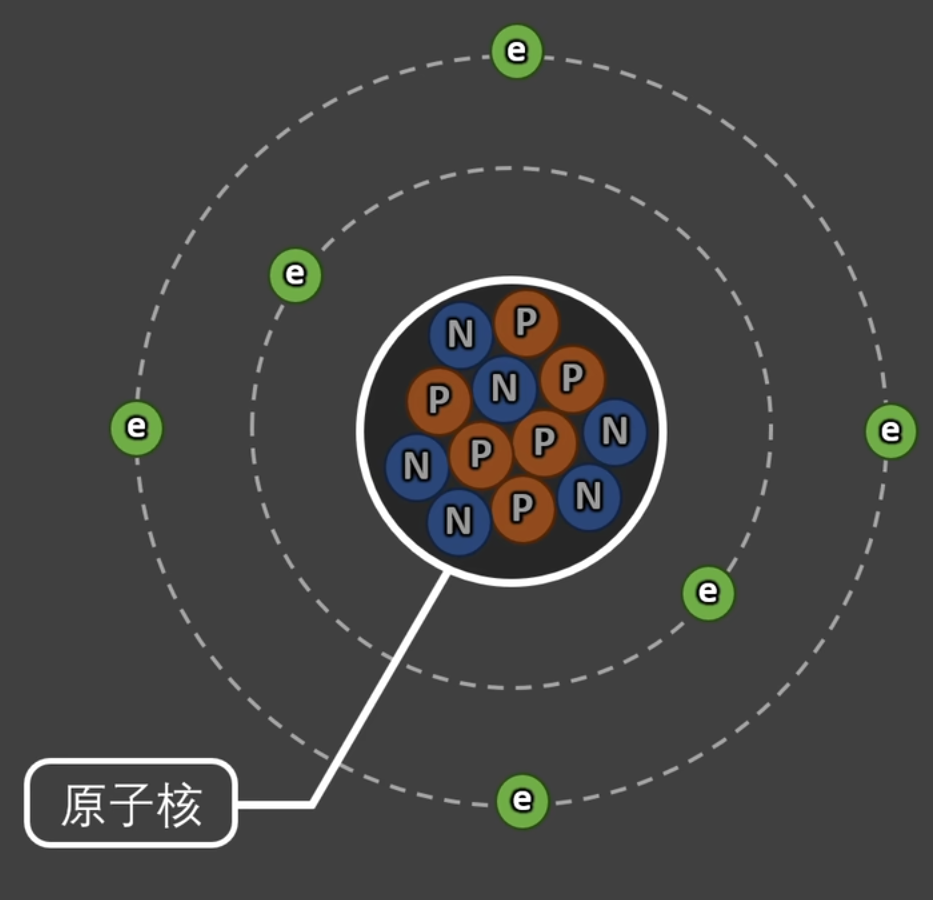
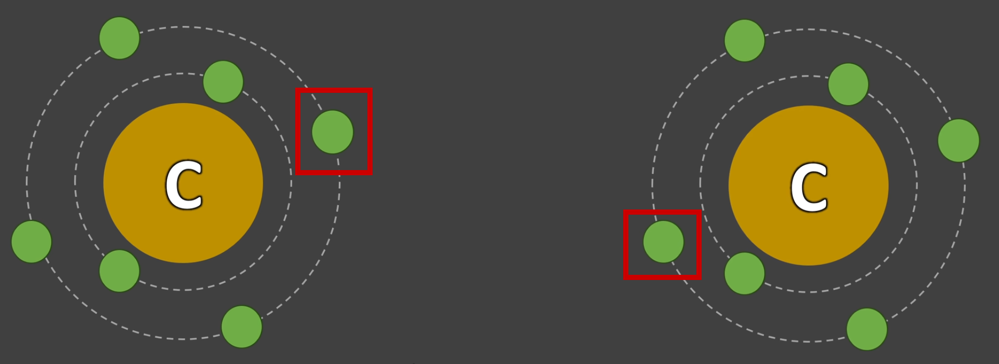
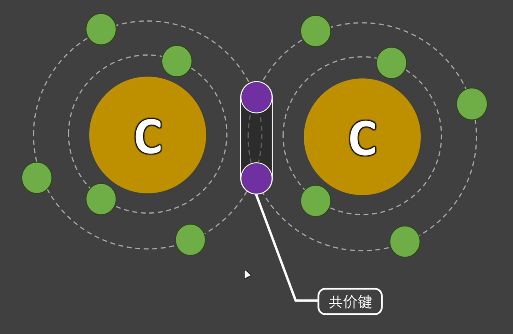
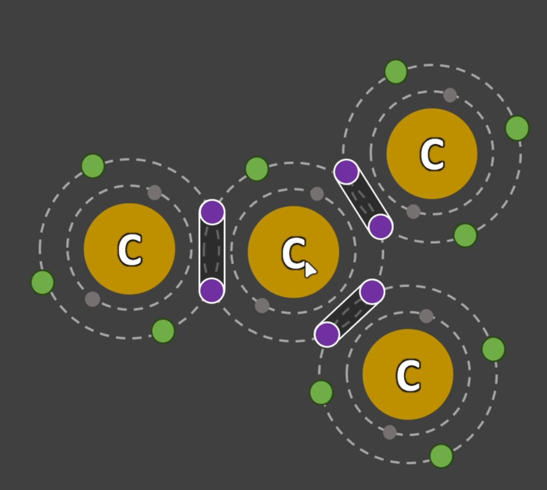
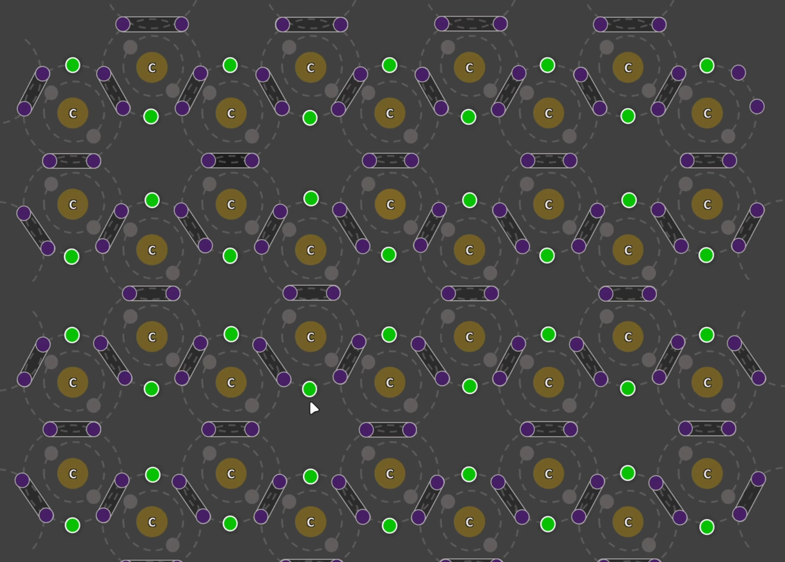
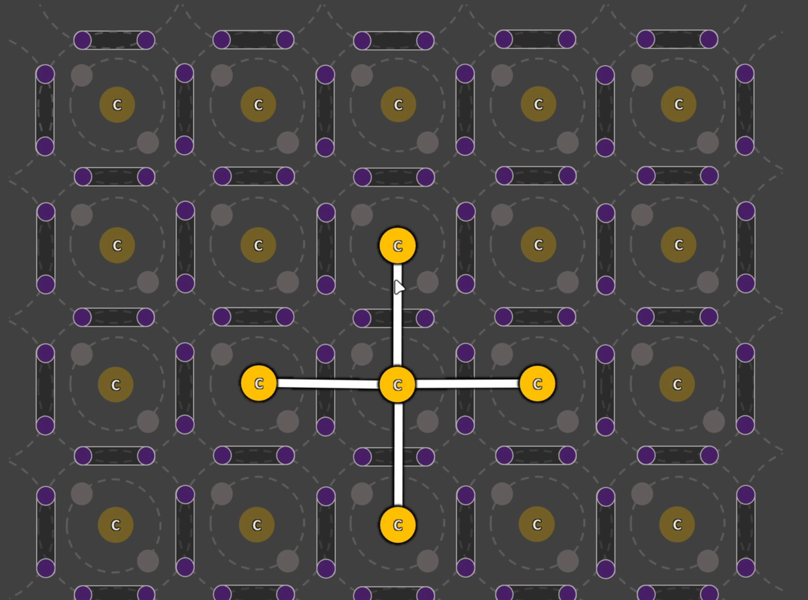

# 原子结构(C)

  
P:质子(Proton)  
N:中子(Neutron)  
e:电子(Electron)

- 质子与中子紧密的结合在一起.  
- 质子决定了元素种类.  
- 中子不重要(略)  
- 电子带负电.
- 中子不带电.
- 质子带正电.  
- 每层最大电子数: $$ 2n^2 $$  n: 层数.  
- 最外层电子数为8时. 是较稳定的状态.  
- 同(电)性相斥. 异性相吸.

# 原子组合(石墨)
两个碳原子各选出一个最外层电子. 组合.  
  
  
多个碳原子组合  
  
中间碳原子最外层电子有一个没有组合的电子.  
它使得电子可以流动.

## 石墨的原子排列

绿色的电子可以自由的运动. 它使得电流可以形成.

## 金刚石的原子排列
  
没有一个没有组合的电子. 导电性就不太行.

注: 不要看就30行. 我练习打字呢. 打得很慢. 妈的打了一个上午. 操你妈的.  
还有我想语言简洁精炼一点.
